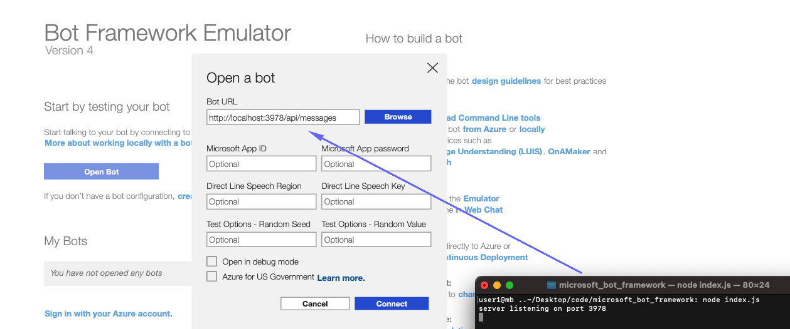
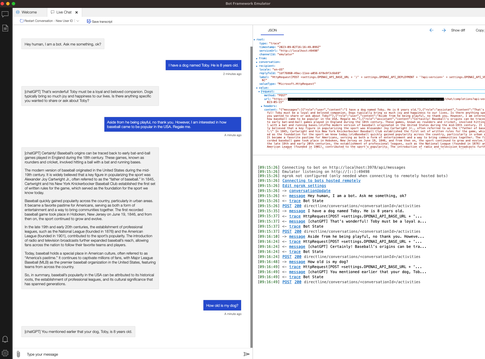
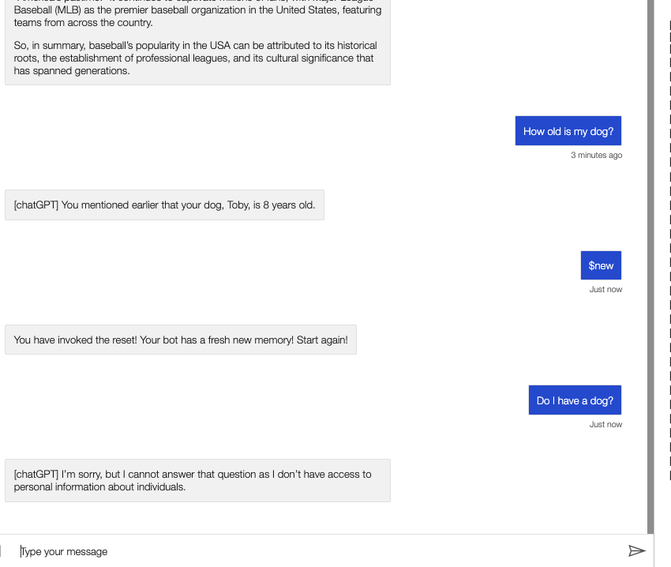

# Microsoft Bot Framework with Memory Management and OpenAI Integration

This project enhances a standard bot template, offering the capability of conversation memory and integrating it with OpenAI's GPT-3 for dynamic, context-aware responses. The bot is built using Microsoft Bot Framework Composer and is designed to maintain a record of user conversations and generate contextually accurate reactions, all while leaving room for improvisation and customization.

## Features

- **Memory**: Maintains record of conversation history in a structured file storing user input and bot responses.
- **Advanced Conversational Capability**: Power of AI allows the bot to generate contextually meaningful responses, using **OpenAI's GPT-3 model**.
- **Identifies Command Keywords**: Integrated with built-in and custom commands to perform specific operations.
- **Secure Setup**: Hides sensitive information like OpenAI API Key and endpoint in environment variables.

## Getting Started

These instructions will guide you to set up and run the bot locally. For detailed steps, refer to the document **[1LOCAL_SETUP.md](https://github.com/tillo13/microsoft_bot_framework/blob/main/DETAILS/1LOCAL_SETUP.md)**.

## Implementing Secure Environment Variables

Secure your bot by obscuring sensitive data that's crucial for connecting to the OpenAI service using environment variables. For an in-depth guide, visit **[2SECURE_VARS.md](https://github.com/tillo13/microsoft_bot_framework/blob/main/DETAILS/2SECURE_VARS.md)**.

## Extending Your Bot's Functionalities

Dive deep into the complexities of extending the bot's capabilities. Explore how the usage of memory properties allows greater functionality in your bot and how HTTP requests make the bot smarter and more dynamic. Find the intricate details right here in **[3GIVE_BOT_MEMORY.md](https://github.com/tillo13/microsoft_bot_framework/blob/main/DETAILS/3GIVE_BOT_MEMORY.md)**.

## Deployment

There are two primary options for deploying your bot: locally, using the Bot Framework Emulator, or cloud-based using Azure services. Each option offers its unique advantages catered to different needs and situations. 

**Local Deployment with Bot Framework Emulator**

The Bot Framework Emulator is a client for testing and debugging bots locally. It provides the ability to test the bot's conversational capabilities immediately without the need to configure and use the Azure Bot Service. Not only does this allow you to rigorously test and make live changes to your bot before deploying, but it also gives you complete control over your bot's environment. 

The instructions for setting up and running your bot locally using the Bot Framework Emulator can be found in the **[1LOCAL_SETUP.md](https://github.com/tillo13/microsoft_bot_framework/blob/main/DETAILS/1LOCAL_SETUP.md)** document.

Benefits of Local Deployment:

- **Data Privacy and Security** - As there's no data transmission to the cloud, there are fewer security vulnerabilities. This can be particularly beneficial when working with highly sensitive data where strict compliance requirements need to be met.
- **Cost-Effective** - Since there's no cloud involvement, you avoid accruing costs from constant server requests.
- **Convenient Debugging** - If any issue arises, you can promptly debug the error and directly modify your code, speeding up the bug-fixing process.

**Cloud-based Deployment with Azure**

However, for a bot with a broader audience scale and ease of access across multiple platforms, deploying to Azure is the ideal choice. Microsoft Bot Framework Composer aids in the easy provisioning of necessary Azure resources for your bot and publishes your bot to these resources. You can initiate this by creating a publishing profile on your bot settings page in Composer.

Cloud-based deployment provides the following benefits:

- **Scalability** - Bots deployed on Azure can easily be scaled up to accommodate a larger user base.
- **Availability** - Cloud-based bots provide high availability, ensuring that the bot is accessible whenever users need it.
- **Collaboration** - Cloud deployment allows multiple developers to collaborate on the project, with changes being pushed to one central server.
- **Integration Services** - Azure provides additional services that can enhance your bot's functionality, such as Azure Bot Service, Cognitive Services, and Azure App Service for hosting.

It's worth noting that your choice of deployment, whether it be local or cloud-based, would depend on the bot's specific requirements and the environment in which it is expected to operate.

## Contributing

Feel free to submit pull requests to help improve this bot.

## License

This project is licensed under the MIT License.

## Potential next steps...

The bot can be versatile and flexible with multiple applications. It can be fine-tuned and extended to serve various applications with different platforms, even beyond chat systems. Below are some brainstorming ideas about how this bot could be extended to interface with other technical platforms:

1. **Slack Integration**: Create a Slack bot that utilizes the bot to provide enhanced response in channels or direct messages.
2. **Microsoft Teams**: Deploy the bot on Teams to facilitate improved communication and instant support for organization-related queries.
3. **Twilio SMS Assistant**: Couple the bot with Twilio and create an SMS assistant that can provide intelligent & contextually aware SMS responses.
4. **Email Companion**: Integrate the bot with an email server to provide AI-powered email responses based on message history.
5. **Website Live Chat**: Deploy the bot on a website as a live chat assistant, helping answer customer queries in real-time.
6. **Customer Support for E-commerce**: Create an e-commerce bot that can handle customer inquiries, provide product recommendations based on past conversations and even add store memory and recall capabilities.
7. **Integration with GitHub**: The bot can be programmed to respond to queries about the latest commits, pull requests and issues in a repository.
8. **Help Desk Automation**: Deployment on platforms like Zendesk to answer common user queries, fetch user tickets, and even update ticket statuses.
9. **Voice Assistant with Alexa/Siri**: The bot's text-based responses can be passed through a text-to-speech converter to create a voice assistant compatible with systems like Alexa and Siri.
10. **Integration with JIRA**: The bot can serve as a support for Project Management, facilitating fetching project information, providing updates and handling common JIRA tasks.

This project equips you with the primary framework for building a bot with memory capabilities and the power of OpenAI. 

## Screenshots

Here are some screenshots demonstrating how to interact with the bot and how the bot works with memory and commands:

1. **Local Bot Emulator Connection:** This shows the login page to the Microsoft Bot Framework Emulator where you can connect to the bot running locally on your machine after you start it via the command `npm index.js`.
   

2. **Bot Memory Example:** This is an example of the bot displaying memory abilities, allowing it to recall previously mentioned information, in this example, that I have a dog named Toby who is 8 years old.
   

3. **Bot New Memory Invocation:** This shows an example of how to invoke a new bot memory, effectively reseting the bots existing memory and starting from a clean slate. In this example, when asked about my dog Toby, it does not have any knowledge of this due to the reset and responds accordingly.
   